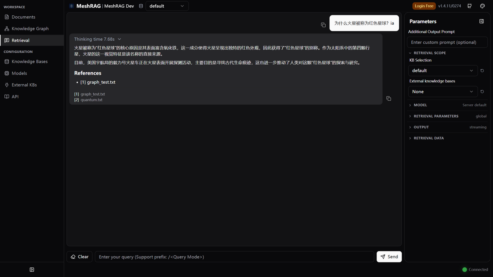

<div align="center">

# MeshRAG

**Multi-Knowledge-Base Graph RAG engine, based on [LightRAG](https://github.com/HKUDS/LightRAG)**

[](https://pypi.org/project/meshrag/)
[](https://pypi.org/project/meshrag/)
[](https://github.com/tuxin-labs/meshrag/actions/workflows/tests.yml)
[](https://github.com/tuxin-labs/meshrag/pkgs/container/meshrag)
[](LICENSE)

[中文文档](README-zh.md) · [License](#license) · Python 3.10+

</div>

> [!NOTE]
> MeshRAG is a fork of [HKUDS/LightRAG](https://github.com/HKUDS/LightRAG) (v1.4.11, upstream state as of 2026-03-08), redistributed under the MIT License with gratitude to the upstream team.
> The Python module is still `import lightrag` for ecosystem compatibility; the distribution is `pip install meshrag`.
> Inherited upstream documentation is preserved in [docs/LightRAG-upstream-usage.md](docs/LightRAG-upstream-usage.md).

## Why MeshRAG

MeshRAG keeps the LightRAG graph-RAG engine (entity/relation extraction, multi-mode graph retrieval, pluggable storage) and adds what production multi-team deployments need:

### 🔀 Multi-knowledge-base federated query

One API call retrieves from **multiple local knowledge bases together with
registered external knowledge bases** (`external_kbs`):

1. All sources are queried in parallel: each local KB returns chunks + knowledge
   graph context; `retrieval`-type external services return chunks, while
   `rag`-type external services return ready-made answers
2. Chunks from every source land in one pool for global deduplication and budget control
3. Cross-source chunk reranking (with optional reranker)
4. Reference/citation rebuilding so answers cite the right KB or external service
5. LLM answer generation with the merged context — a single `rag`-type external
   answer is passed through as-is, several are synthesized by the LLM

One failing external service never fails the whole query — its error is reported
in `metadata.external_kb_errors` while the remaining sources answer normally.

### 🌐 External knowledge base integration

Federate **external retrieval/RAG APIs** into the same query flow via `external_kbs`:

- `retrieval` type: the external API returns similar text chunks; MeshRAG's LLM generates the answer
- `rag` type: the external API is a full RAG service and returns a final answer

Registry endpoints under `/external_kbs` manage connection profiles with a
built-in connectivity test per entry; queries can pass inline configs via
`external_kbs` or reference registered profiles by id via `external_kb_ids`;
and `POST /ext/retrieval` ships a mock `retrieval`-type service (backed by your
own KBs) for integration testing.

### 🗂️ Knowledge-base lifecycle APIs

Create, list, and delete knowledge bases at runtime — query them alone or federated:

- `GET /knowledge_bases` — list knowledge bases
- `GET /knowledge_bases/stats` — per-KB document and entity counts in one call
- `POST /knowledge_bases` / `DELETE /knowledge_bases/{kb_id}` — provision or remove a KB
- `POST /query/data` — retrieval-only variant of `/query`: returns the entities,
  relationships, chunks, and references that were hit, without LLM generation

### 📄 Document management APIs

Upload/status pipeline plus direct text ingestion without files
(`POST /documents/text`, batch via `/documents/texts`), and fast
single-document lookup by file path —
`GET /documents/by_file_path?kb_id=...&file_path=...` — avoiding expensive
pagination when the document set is large.

### 🔒 Deletion/parsing concurrency pipeline

Cooperative cancellation and deletion semantics with crash recovery:
deletion requests take priority over in-flight processing, interrupted
documents resume instead of being reset, and transient failures do not get
misreported as permanent failures.

### 🖥️ Management WebUI

The bundled React UI (`lightrag_webui`) mirrors the API for day-to-day operation:



- **Documents** — upload files or paste text, watch the parsing pipeline, rescan/retry
- **Knowledge Graph** — browse and edit entities and relations (create, edit, merge)
- **Retrieval** — chat-style playground with a per-query mode/parameter panel, KB
  selectors, streaming answers with citations, and a retrieval dry-run inspector
  that shows the raw hits (entities/relations/chunks) behind an answer
- **Models** — register LLM profiles server-side and pick one per query;
  API keys never reach the browser
- **External KBs** — manage and test federation targets
- Localized UI in 11 languages

### 🧬 Everything inherited from LightRAG

- Graph-based knowledge representation with local / global / hybrid / naive / mix / bypass query modes
- Pluggable storage backends (JSON, Redis, PostgreSQL, MongoDB, Milvus, Qdrant, Neo4j, Memgraph, Faiss, NetworkX)
- WebUI, Ollama-compatible API, streaming responses
- Workspace isolation for multi-tenant deployment

## Quick Start

### Install

```bash
pip install meshrag            # core
pip install "meshrag[api]"     # with API server support
```

### A simple program

```python
import os
import asyncio
from lightrag import LightRAG, QueryParam
from lightrag.llm.openai import gpt_4o_mini_complete, openai_embed
from lightrag.utils import setup_logger

setup_logger("lightrag", level="INFO")

WORKING_DIR = "./rag_storage"
if not os.path.exists(WORKING_DIR):
    os.mkdir(WORKING_DIR)

async def initialize_rag():
    rag = LightRAG(
        working_dir=WORKING_DIR,
        embedding_func=openai_embed,
        llm_model_func=gpt_4o_mini_complete,
    )
    # IMPORTANT: Both initialization calls are required!
    await rag.initialize_storages()  # Initialize storage backends
    return rag

async def main():
    rag = await initialize_rag()
    await rag.ainsert("Your text")
    result = await rag.aquery(
        "Your question", param=QueryParam(mode="hybrid")
    )
    print(result)
    await rag.finalize_storages()  # REQUIRED for cleanup

asyncio.run(main())
```

### ⚠️ Important: Initialization Requirements

**MeshRAG requires explicit initialization before use.** You must call
`await rag.initialize_storages()` after creating a `LightRAG` instance, and
`await rag.finalize_storages()` for cleanup — otherwise you will encounter
errors such as `AttributeError: __aenter__`.

### API server

```bash
cp env.example .env    # or run `make env-base` for the interactive wizard
meshrag-server         # production
meshrag-gunicorn       # multi-worker
```

Docker:

```bash
# Run the prebuilt public image (no local build needed)
cp env.example .env           # configure LLM / embedding providers first
docker run -d --name meshrag -p 9621:9621 \
  -v ./data/rag_storage:/app/data/rag_storage \
  -v ./data/inputs:/app/data/inputs \
  -v ./.env:/app/.env \
  ghcr.io/tuxin-labs/meshrag:latest

docker compose up -d          # same image via Compose
docker build -t meshrag .     # build the full image yourself (frontend + backend)
docker build -f Dockerfile.lite .  # lite image (API + offline storage only)
```

### Multi-KB query example

`POST /query` accepts `kb_ids` (local KBs) and `external_kbs` in the same request:

```json
{
  "query": "Which contracts mention data-residency requirements?",
  "mode": "mix",
  "kb_ids": ["contracts-2025", "policies"],
  "external_kbs": [
    {
      "type": "retrieval",
      "url": "https://kb.example.com/api/search",
      "api_key": "sk-...",
      "top_k": 5
    }
  ]
}
```

Results from all sources are deduplicated, reranked, and cited in one answer.
See the field descriptions in `lightrag/api/routers/query_routes.py` for the
full contract of each external KB type.

## Query Modes

| Mode | Description |
|---|---|
| `local` | Context-dependent retrieval focused on specific entities |
| `global` | Community/summary-based broad knowledge retrieval |
| `hybrid` | Combines local and global |
| `naive` | Direct vector search without graph |
| `mix` | Integrates KG and vector retrieval (recommended with a reranker) |
| `bypass` | Skip retrieval; send conversation history and the question straight to the LLM |

## Storage Backends

| Layer | Backends |
|---|---|
| KV (LLM cache, chunks, doc info) | JSON (default), Redis, PostgreSQL, MongoDB |
| Vector (embeddings) | NanoVectorDB (default), Faiss, Milvus, Qdrant, PostgreSQL, MongoDB |
| Graph (entity-relation) | NetworkX (default), Neo4j, PostgreSQL+AGE, MongoDB, Memgraph |
| Doc status | JSON (default), Redis, PostgreSQL, MongoDB |

Configure via environment variables — see [env.example](env.example) for the
full annotated list, including `LIGHTRAG_SSL_VERIFY` for deployments with
self-signed TLS certificates.

## Documentation

- [docs/LightRAG-upstream-usage.md](docs/LightRAG-upstream-usage.md) — inherited engine documentation (configuration, storage setup, API details)
- [docs/external_kb_usage.md](docs/external_kb_usage.md) — external knowledge base integration guide (Chinese)
- [CHANGELOG.md](CHANGELOG.md) — release notes
- [docs/OfflineDeployment.md](docs/OfflineDeployment.md) — air-gapped deployment
- [docs/DockerDeployment.md](docs/DockerDeployment.md) — Docker deployment
- [docs/FrontendBuildGuide.md](docs/FrontendBuildGuide.md) — WebUI build
- [docs/InteractiveSetup.md](docs/InteractiveSetup.md) — interactive `.env` wizard
- [CONTRIBUTING.md](CONTRIBUTING.md) — development and PR guidelines

## Development

```bash
# Backend
uv sync                  # core package
uv sync --extra api      # API server support
uv sync --extra test     # testing dependencies

uv run ruff check .      # lint
uv run pytest tests/     # offline suite (pass --run-integration for live services)
```

Interactive configuration wizard (writes `.env`, assembles `docker-compose.final.yml`):

```bash
make env-base            # LLM, embedding, reranker (run first)
make env-storage         # storage backends (optional)
make env-server          # port / security / SSL (optional)
make env-validate        # validate an existing .env
```

WebUI (React 19 + TypeScript; Bun is mandatory):

```bash
cd lightrag_webui
bun install
bun run dev              # dev server with hot reload
bun run build            # production bundle → lightrag/api/webui
bun test
```

## License

MeshRAG is licensed under the [MIT License](LICENSE).
Copyright 2026 MeshRAG Team; original LightRAG code Copyright 2025 LightRAG Team.
See [NOTICE](NOTICE) for details.

## Acknowledgements

- [LightRAG (HKUDS)](https://github.com/HKUDS/LightRAG) — the engine this project is built on. If MeshRAG is useful to you, please also star the upstream project.
- LightRAG paper: [arXiv:2410.05779](https://arxiv.org/abs/2410.05779)
